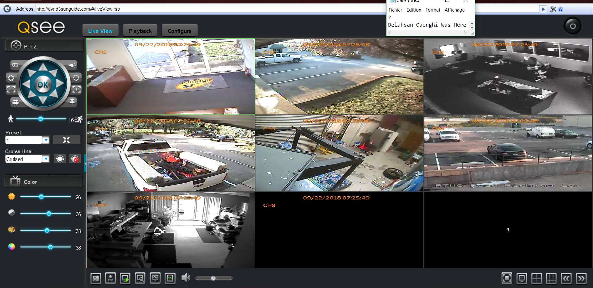

# DVR-Exploiter
	[*] Exploit Title:       DVR Credentials Exposed 
	[*] Date:                09/04/2018
	[*] Exploit Author:      Fernandez Ezequiel
	[*] DVR-Exploiter By:    Belahsan Ouerghi  
	[*] Contact:             www.facebook.com/ouerghi.belahsan
	[*] Youtube Tutorial:	 https://www.youtube.com/watch?v=vdnATjE_4II
	[*] Dorks:               		       intitle:"DVR Login"
		                                       html:"/login.rsp"
		                                      "Server: GNU rsp/1.1"
 
                                             
## tested in DVR :
	Novo
	CeNova
	QSee
	Pulnix
	XVR 5 in 1 (title: "XVR Login")
	Securus,  - Security. Never Compromise !! - 
	Night OWL
	DVR Login
	HVR Login
	MDVR Login
  ## Installation : 
  ```
  $ git clone https://github.com/TunisianEagles/DVR-Exploiter.git
  $ cd DVR-Exploiter
  $ chmod +x DVR-Exploiter.sh
  $ ./DVR-Exploiter.sh
  ```
  ## Details
  [ After Running Choose The Host Example : 1 = 127.0.0.1 {IP } , / 2 = www.xxxxxxxx.com  ]
 * Don't Forget To Install The Plugin Of The DVR 
  # Screenshots
  
  
   
   
   
   
   
   
   
   
   
   
   
   
   

  # Tutorial :
https://www.yeahhub.com/exploitation-dvr-cameras-cve-2018-9995-tutorial/
